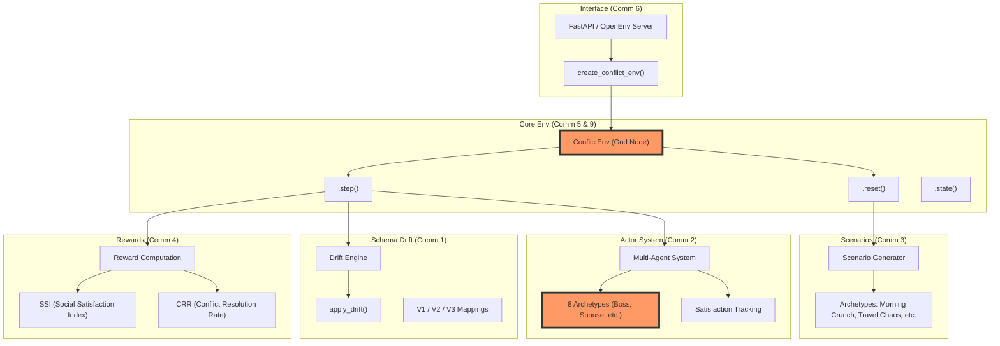

# Graphify Analysis Output: ConflictEnv

This directory contains the structural analysis of the **ConflictEnv** codebase, generated via Graphify. ConflictEnv is a high-fidelity Reinforcement Learning environment designed for training LLMs to resolve cascading scheduling conflicts under schema drift.

## 📂 Directory Contents

| File | Description |
| :--- | :--- |
| [**GRAPH_REPORT.md**](./GRAPH_REPORT.md) | A detailed summary of the codebase, including detected communities, "God Nodes" (core abstractions), and structural insights. |
| [**graph.html**](./graph.html) | An interactive, browser-based visualization of the code dependency graph. |
| [**graph.json**](./graph.json) | The raw data representation of the graph (nodes, edges, and community assignments). |

---

## 🏗️ Architectural Overview

Based on the graph analysis, the system is organized into several distinct functional communities centered around the `ConflictEnv` bridge.

---

## 🔍 Key Insights from the Graph

*   **Central Hubs**: `ConflictEnv` and `Actor` are the primary "God Nodes," serving as the connective tissue between the simulation logic, reward systems, and the external API.
*   **Modular Decoupling**: The **Schema Drift Engine** (Community 1) and **Reward Computation** (Community 4) are highly cohesive but modular, allowing for independent tuning of the benchmark's difficulty and scoring.
*   **Cascading Logic**: The analysis reveals strong inferred connections between `ConflictAction` and the `Scenario` archetypes, highlighting how agent decisions ripple through the multi-agent schedule.

---
*Analysis generated on 2026-04-22 for the MetaxBangalore Hackathon.*
