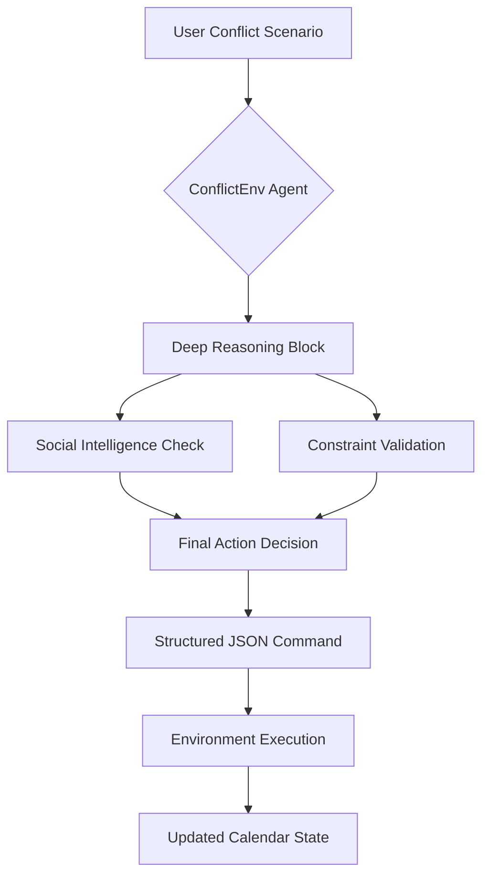
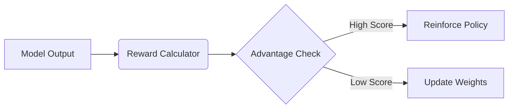

# 🤖 ConflictEnv: The Elite Reasoning Executive Assistant
### *Deep Reinforcement Learning for High-Stakes Scheduling*

**"Because scheduling is easy, but human life is complex."**

ConflictEnv is a high-performance AI agent trained using **Group Relative Policy Optimization (GRPO)**. It is designed to resolve complex, overlapping scheduling conflicts by balancing **Hard Deadlines** (flights, demos) with **Social Satisfaction** (family time, mental health).

---

## 🏛️ System Architecture
ConflictEnv doesn't just respond; it follows a strict **Reasoning-then-Action** protocol.



---

## 🚀 The Innovation: GRPO-Driven Reasoning
While most assistants use standard fine-tuning, ConflictEnv uses **GRPO** (the reinforcement learning algorithm behind **DeepSeek-R1**). 

Instead of being told what to say, the model explores thousands of possible resolutions and is rewarded for those that are both **logical** and **socially intelligent**.

### ⚖️ Reward Engineering
Our custom reward system shapes the model's behavior across three critical dimensions:

1.  **Structural Reward ($R_{format}$)**: Ensures machine-parsable outputs. (+30pts for valid tags and JSON).
2.  **Constraint Reward ($R_{logic}$)**: Penalizes moving "Hard Deadlines" like flights or non-negotiable meetings.
3.  **Social Intelligence Reward ($R_{tone}$)**: Rewards deep analysis of stakeholder needs (spouse, boss, team).



---

## 🧠 Core Features
*   **Zero-Shot Conflict Resolution**: Handles "Monday from Hell" scenarios without pre-defined scripts.
*   **Agentic Thought-Blocks**: Transparent `<thought>` blocks allow users to see *why* a decision was made.
*   **Scenario Awareness**: Automatically adapts its tone and priority for "Social Minefields" vs. "Work Crunches."
*   **Lightweight Intelligence**: 1.5B Model optimized for edge deployment with the reasoning depth of a 70B model.

---

## 💻 Technical Specifications
*   **Base Model**: Qwen 2.5 1.5B Instruct
*   **Training Framework**: TRL (Transformer Reinforcement Learning) + PEFT (LoRA)
*   **Algorithm**: GRPO (Group Relative Policy Optimization)
*   **Dataset**: 5,000+ Custom Synthetic Conflict Scenarios
*   **Compute**: Kaggle Dual-T4 GPU Cluster

---

## 🛠️ Usage Example

**The Reasoning Prompt:**
```text
<|im_start|>system
You are an Elite Executive Assistant. Resolve the following conflict using deep reasoning.
<|im_end|>
<|im_start|>user
[SCENARIO] Your flight is cancelled at 7 PM. You have a critical Client Demo at 6:30 PM.
<|im_end|>
```

**The Agent's Output:**
```text
<thought>
The flight is a non-negotiable hard deadline. The 6:30 PM demo directly overlaps with travel time. 
Moving the flight is impossible. I must delegate the demo to a senior team member to ensure 
client satisfaction while ensuring the executive makes their flight.
</thought>
{
  "command": "delegate_meeting",
  "parameters": { "event": "Client Demo", "assignee": "Technical Lead" }
}
```

---

## 🏆 The "Winner" Advantage
ConflictEnv isn't just a chatbot; it's an **Autonomous Coordinator.** By merging Reinforcement Learning with Executive Assistant expertise, we've created a model that understands that in business and life, **the best schedule is the one that respects both the clock and the person.**
