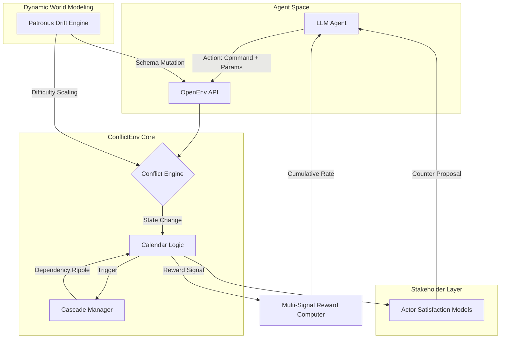
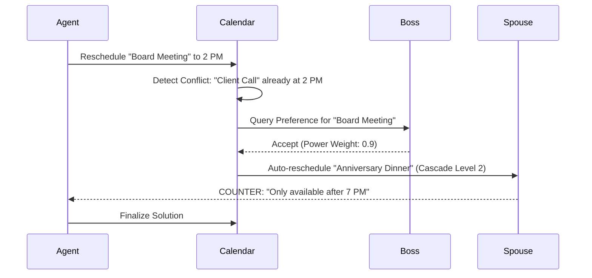
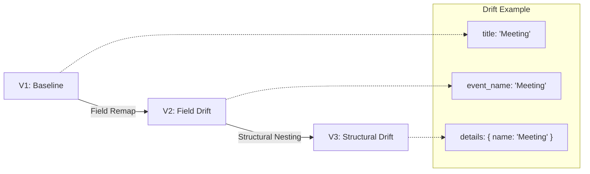

# ConflictEnv: A Social Negotiation Benchmark for LLM Agents

ConflictEnv is a high-fidelity reinforcement learning environment designed to train and evaluate LLM-based personal assistants on cascading scheduling conflicts and dynamic schema drift. It provides a standardized framework for testing an agent's ability to navigate complex human dependencies, social prioritization, and breaking API contracts in real-time.

---

## Executive Summary

Most personal assistant benchmarks focus on static tool use or simple information retrieval. ConflictEnv addresses a more significant challenge: Social Negotiation. In this environment, a scheduling change is not just a database update; it is a ripple effect across a network of seven distinct stakeholders with competing interests and satisfaction curves.

By integrating the Patronus AI Schema Drift engine, ConflictEnv also forces agents to maintain operational stability even when the underlying data structures (API field names, nesting, and protocols) mutate between episodes.

---

## System Architecture



---

## Core Technical Features

### 1. Multi-Agent Negotiation Engine
The environment simulates seven unique actor types:
- Professional: Boss, Client
- Personal: Spouse, Family
- Institutional: School, Doctor, Airline
Each actor possesses unique power-weights, satisfaction models, and the ability to generate counter-proposals during conflict resolution.

### 2. Cascading Conflict Logic
A single modification to the calendar can trigger 3-5 levels of dependent conflicts. Agents must perform long-horizon planning to ensure that resolving a Monday conflict does not create an unresolvable failure on Friday.

### 3. Dynamic Schema Drift (V1-V3)
To simulate real-world API evolution, the environment supports three levels of schema drift:
- Version 1: Baseline OpenEnv protocol.
- Version 2: Field remapping (e.g., "title" to "event_name").
- Version 3: Structural nesting (e.g., moving metadata into a "details" object).

---

## Technical Workflows

### 1. Conflict Cascade Ripple


### 2. Schema Drift Lifecycle


---

## Hackathon Theme Alignment

ConflictEnv is designed to address all five core themes of the OpenEnv competition:

| Theme | Implementation Strategy |
| :--- | :--- |
| Multi-Agent | Seven distinct actor types with individual satisfaction modeling. |
| Long-Horizon | Multi-day cascading dependency chains requiring strategic foresight. |
| World Modeling | Dynamic Schema Drift engine testing agent robustness against API mutation. |
| Personal Tasks | Native integration with .ics and .json calendar data for personalized utility. |
| Self-Improvement | Adaptive curriculum scaling difficulty based on rolling reward rates. |

---

## OpenEnv Protocol Documentation

ConflictEnv is fully compliant with the OpenEnv REST API specification.

### Endpoints

#### POST /reset
Initializes a new episode.
- Parameters: `drift_version` (optional), `difficulty` (optional).
- Returns: Initial observation and task description.

#### POST /step
Executes an agent action.
- Parameters: `command`, `parameters`.
- Returns: Observation, Reward, Terminated status, and SSI (Stakeholder Satisfaction Index).

#### GET /state
Returns the current raw state of the environment for inspection.

#### GET /health
Returns environment status, model metadata, and active drift version.

---

## Installation and Deployment

### Docker Deployment
The environment is optimized for deployment on Hugging Face Spaces or local Docker containers.

```bash
docker build -t conflict-env .
docker run -p 7860:7860 conflict-env
```

### Local Development
```bash
pip install -r requirements.txt
python app.py
```

---

## Acknowledgments
ConflictEnv was developed for the Meta x Bangalore Hackathon 2025. It leverages the OpenEnv framework and draws inspiration from the Patronus AI schema drift benchmarks.
