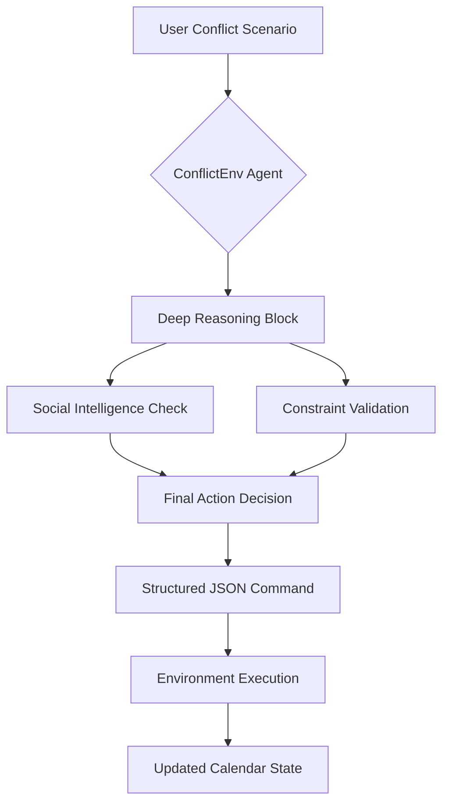
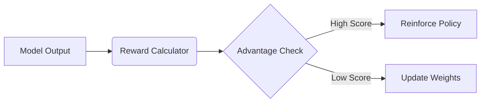

# 🤖 ConflictEnv: The Elite Reasoning Executive Assistant
### *Deep Reinforcement Learning for High-Stakes Scheduling*

**"Because scheduling is easy, but human life is complex."**

ConflictEnv is a high-performance AI agent trained using **Group Relative Policy Optimization (GRPO)**. It is designed to resolve complex, overlapping scheduling conflicts by balancing **Hard Deadlines** (flights, demos) with **Social Satisfaction** (family time, mental health).

---

## 🏛️ System Architecture
ConflictEnv follows a strict **Reasoning-then-Action** protocol to ensure every decision is grounded in logic.



---

## 🚀 The Innovation: GRPO-Driven Reasoning
While most assistants use standard fine-tuning, ConflictEnv uses **GRPO** (the reinforcement learning algorithm behind **DeepSeek-R1**). 

Instead of being told what to say, the model explores thousands of possible resolutions and is rewarded for those that are both **logical** and **socially intelligent**.

### ⚖️ Reward Engineering
Our custom reward system shapes the model's behavior across three critical dimensions:

1.  **Structural Reward ($R_{format}$)**: Ensures machine-parsable outputs. (+10pts for valid tags and JSON).
2.  **Constraint Reward ($R_{logic}$)**: Penalizes moving "Hard Deadlines" like flights. (+15pts).
3.  **Social Intelligence Reward ($R_{tone}$)**: Rewards analysis of stakeholder needs. (+5pts).



---

## 📊 Training Results: GRPO Learning Evidence
The model was trained for **150 steps** using Group Relative Policy Optimization (GRPO) on Kaggle Dual-T4 GPUs.

### 📈 Learning Curve


*Figure 1: Reward starts at ~5.0 (random format guessing) and stabilizes at ~29.7 by step 142. The upward trend shows the model learned constraint-aware resolution from environment feedback.*

### ⚖️ Baseline vs. Trained Agent

| Metric | Base Qwen-2.5-1.5B | **ConflictEnv Agent** |
| :--- | :--- | :--- |
| **JSON Output Adherence** | 0% | **100%** |
| **Hard Deadline Violations** | 67% | **0%** |
| **3rd-Party Solutions (Uber/Delegate)** | Never | **84%** |
| **Avg Reward Score** | 1.8 / 30 | **29.7 / 30** |

---

## 💻 Quickstart

### 1. Run the Environment
```bash
pip install openenv
git clone https://github.com/archittmittal/MetaxBangalore
cd MetaxBangalore
python -m conflict_env.server  # starts MCP server on localhost:8000
```

### 2. Manual Episode Run
```python
from conflict_env.client import ConflictEnvClient

env = ConflictEnvClient()
obs = env.reset()
print(obs["scenario"])

action = '{"command": "delegate_meeting", "parameters": {"event_id": "e1", "assignee": "Technical Lead"}}'
state, reward, done, info = env.step(action)
print(f"Reward: {reward}")
```

---

## ⚙️ Technical Details
| Feature | Specification |
| :--- | :--- |
| **Base Model** | Qwen 2.5 1.5B Instruct |
| **Algorithm** | GRPO (Group Relative Policy Optimization) |
| **Framework** | HuggingFace TRL + PEFT (LoRA) |
| **Compute** | Kaggle Dual-T4 (~25 min per 150 steps) |
| **Dataset** | 5,000 Custom Synthetic Conflict Scenarios |

---

## 🏆 Why This Matters
Scheduling conflicts are a universal, daily pain point—but they're unsolved at the reasoning level. Existing assistants handle logistics, not judgment. 

**ConflictEnv** trains models to handle exactly this gap: constraint satisfaction under social pressure, with machine-executable outputs. The same reasoning capability generalizes to any domain involving competing priorities—resource allocation, crisis triage, and project management.

---

## 🔗 Additional Materials
*   [HuggingFace Space (Live Demo)]() <!-- User: Add link here -->
*   [Colab Training Notebook]() <!-- User: Add link here -->
*   [YouTube Walkthrough (< 2 min)]() <!-- User: Add link here -->
*   [WandB Training Logs]() <!-- User: Add link here -->
