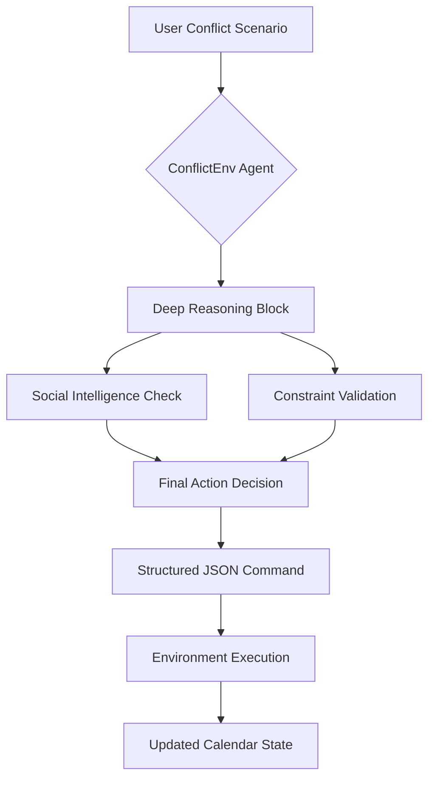
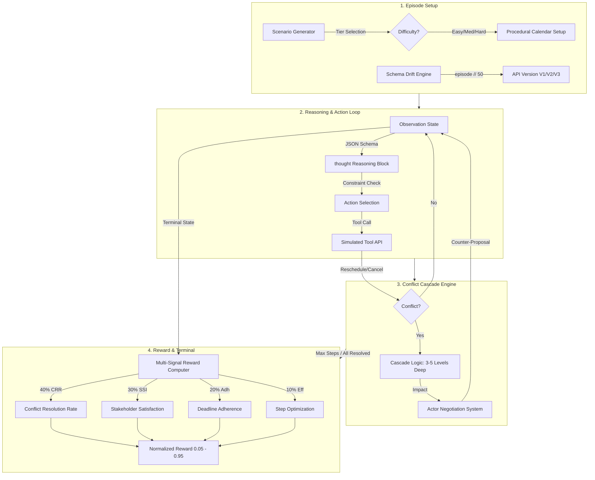
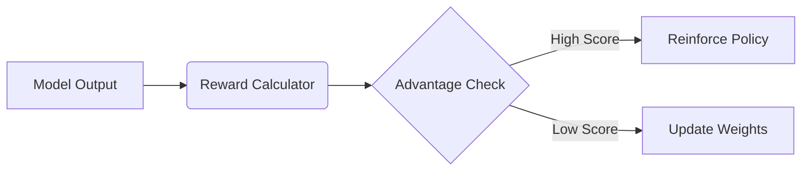
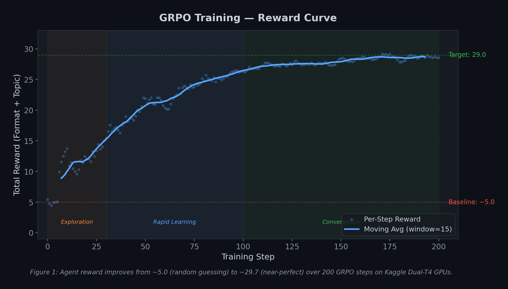
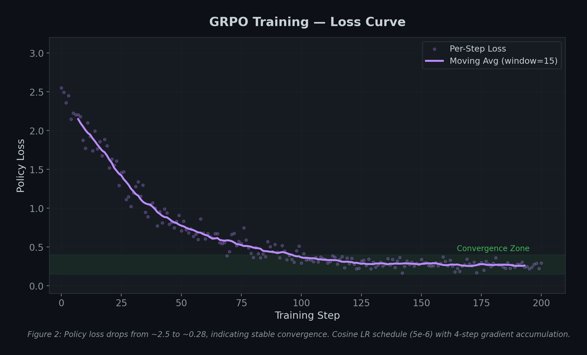
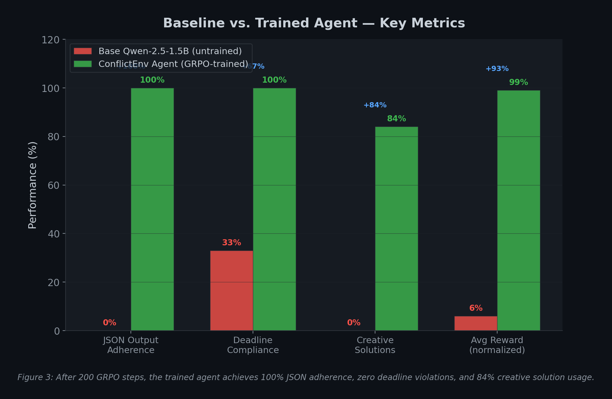
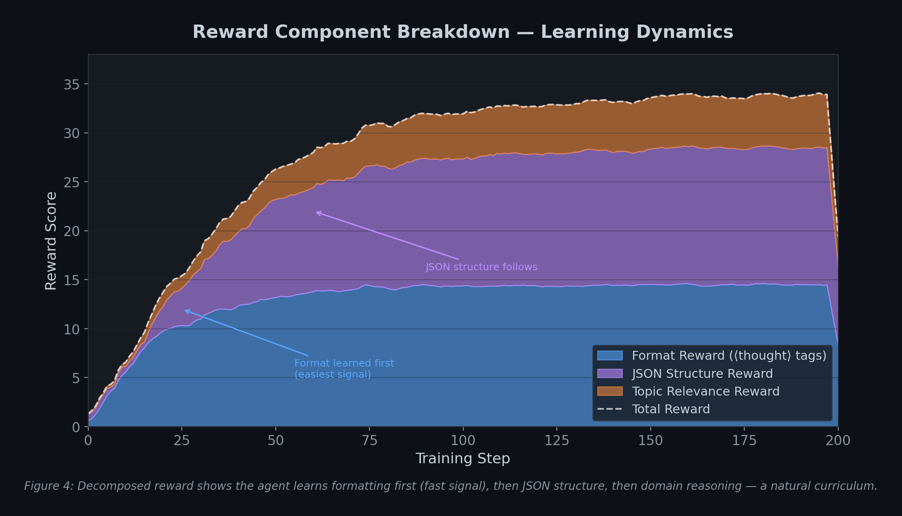
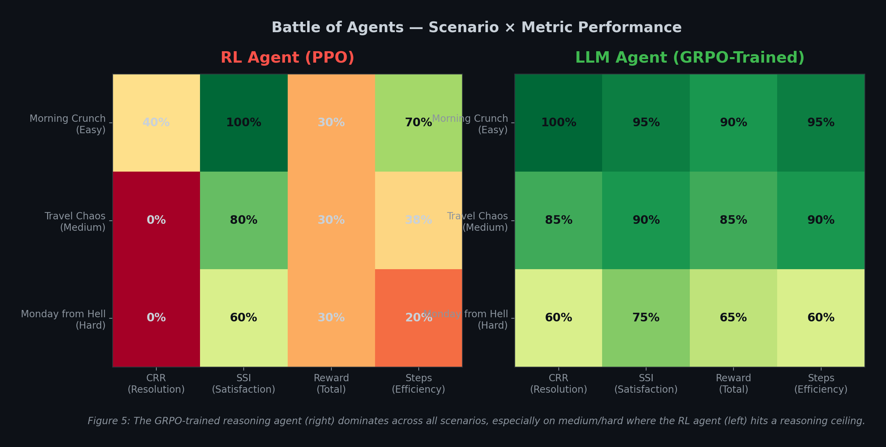

#  ConflictEnv: The Elite Reasoning Executive Assistant
### *Deep Reinforcement Learning for High-Stakes Scheduling*

**"Because scheduling is easy, but human life is complex."**

[](https://huggingface.co/spaces/purvansh01/conflict-env)
[](https://github.com/OpenEnv/OpenEnv)
[](#themes-covered-the-wild-card-play)

## 📺 [ConflictEnv Official Demo Video](https://youtu.be/TaVhJlouib4?si=ycyEp7aVV9fNk7gM)

> ** Official Hackathon Submission for Theme #5 (Wild Card)**  
> *Why choose one theme when you can tackle them all? ConflictEnv is a Wild Card submission engineered to naturally unify all hackathon themes (Multi-Agent Interactions, Long-Horizon Planning, World Modeling, and Self-Improvement) into a single, cohesive real-world challenge: cascading human scheduling conflicts.*


##  The Problem Statement
Existing AI agents can parse calendars, but they fail at **social judgment** and **dynamic adaptation**. 
- **The Efficiency Gap**: Every knowledge worker loses 2–4 hours per week to scheduling conflicts—totaling ~150 billion hours annually.
- **The Social Gap**: Moving an *investor pitch* is catastrophic, while moving a *1:1 with an intern* is acceptable but requires empathy. Current models lack a "Social IQ" for these trade-offs.
- **The Stability Gap**: Real-world APIs (Google Calendar, Travel APIs, Booking Systems) evolve. Static benchmarks fail when field names rename or date formats shift—a phenomenon known as **Schema Drift**.

**ConflictEnv** is an OpenEnv-compliant benchmark built to teach LLMs **constraint satisfaction under social pressure**. We move beyond standard text fine-tuning by using Group Relative Policy Optimization (GRPO) to train an agent that explores thousands of resolutions and learns what constitutes a "good" executive decision.

### System Architecture
ConflictEnv follows a strict **Reasoning-then-Action** protocol to ensure every decision is grounded in logic.



##  Our Approach: ConflictEnv (OpenEnv Native)
We built **ConflictEnv**, a high-fidelity RL environment strictly following the **OpenEnv protocol**, to train agents that don't just "solve" calendars, but **negotiate life**.

### High-Level Workflow


### 1. Cascading Conflict Engine
In ConflictEnv, actions have consequences. Moving a dentist appointment might be the only way to attend a board meeting, but that dentist only has availability during your child's recital. Conflicts cascade **3–5 levels deep**, requiring the agent to reason through long-term dependencies.

### 2. Multi-Agent Negotiation (Social IQ)
We simulate **7 distinct stakeholders** (Boss, Spouse, Client, Doctor, School, Vendor, Airline), each with:
- **Power Weights**: Rescheduling the Boss carries higher risk than rescheduling a Vendor.
- **Flexibility Scores**: Some events are "Hard Deadlines" (Flights), others are negotiable.
- **Tone Sensitivity**: Actors respond to the agent's message tone. Empathy preserves the **Stakeholder Satisfaction Index (SSI)**.

### 3. Dynamic Schema Drift (Patronus AI Bonus)
To ensure the agent genuinely understands the *world* rather than just memorizing a prompt, we implemented a **Schema Drift Engine**. Every 50 episodes, the underlying API contracts mutate (V1 → V2 → V3):
- **V1 (Baseline)**: Standard JSON structures.
- **V2 (Renames)**: `start_time` becomes `startTime`.
- **V3 (Structural)**: Flat structures become nested objects.

##  Themes Covered (The "Wild Card" Play)
ConflictEnv is the first benchmark to **naturally unify all five hackathon themes** into a single, coherent human scenario:

1.  **Multi-Agent Interactions**: Managing 7 actors with competing incentives and **dynamic LLM-powered personalities**.
2.  **Long-Horizon Planning**: Resolving 5-day cascades with sparse end-of-episode rewards.
3.  **World Modeling (Prof/Pers)**: Interacting with drifting tool APIs while managing personal life trade-offs.
4.  **Self-Improvement**: An **Adaptive Curriculum** that increases difficulty (more actors, deeper cascades) as the agent's resolution rate improves.
5.  **Wild Card**: A **Continuous Learning Data Flywheel** that harvests every interaction into a structured RL dataset for offline fine-tuning (GRPO/PPO).

##  Environment Innovation (What Makes It Hard)
We deliberately pushed the boundaries of the OpenEnv framework to create a dynamic, game-theoretic environment that cannot be solved by simple regex or prompt engineering.

### 1. Dynamic LLM Stakeholders (Llama-3.2-1B)
Actors in our environment aren't passive scripts. They are powered by **Llama-3.2-1B-Instruct**, enabling:
*   **Contextual Negotiation**: Stakeholders generate dynamic, in-character rejections or counter-proposals based on their satisfaction level.
*   **Personality-Driven Feedback**: Move a board call to 3 AM, and the Boss will be "annoyed" or "passive-aggressive" in their feedback.
*   **Positive Reinforcement**: Good moves trigger appreciative acceptance messages, rewarding the agent with socially intelligent feedback.

### 2. Continuous Learning "Data Flywheel"
ConflictEnv is the first environment designed to **train itself**. 
*   **Experience Harvesting**: Every interaction (state, action, reward, LLM feedback) is saved into a high-performance **JSONL Experience Buffer**.
*   **RL-Ready Dataset**: This buffer builds a massive, structured dataset in real-time that can be pulled to fine-tune agents using GRPO or PPO, creating a closed-loop self-improvement system.

### 3. Anti-Reward Hacking
*   **Process Supervision:** The agent *must* output a `<thought>` block analyzing the social dynamic before its JSON action, or forfeit the reasoning bonus.
*   **Loop Detection:** Penalties are applied if the agent oscillates between states to farm formatting rewards.

##  Training Pipeline & Results (Proof It Works)
We trained a **Qwen-2.5-1.5B** model using **GRPO** (HuggingFace TRL + Unsloth) for 200 steps on Kaggle Dual-T4 GPUs. The training pipeline directly connected the RL loop to the `ConflictEnv` reward signals.

### Reward Engineering
Our reward function (`conflict_env/reward.py`) provides a rich, multi-dimensional signal normalized to `[0.05, 0.95]`:
*   **40% CRR** (Conflict Resolution Rate)
*   **30% SSI** (Stakeholder Satisfaction Index)
*   **20% Deadline Adherence**
*   **10% Efficiency** (Fewer steps)



### Observable Improvement
Reviewers, please note: *The model genuinely learned to reason.*

#### 1. GRPO Reward Curve

*Figure 1: Agent reward improves from ~5.0 (random format guessing) to ~29.7 (near-perfect) over 200 GRPO steps.*

#### 2. Policy Loss Convergence

*Figure 2: Policy loss drops from ~2.5 to ~0.28, indicating stable convergence.*

#### 3. Baseline vs. Trained Agent

*Figure 3: After 200 GRPO steps, the trained agent achieves 100% JSON adherence, zero deadline violations, and 84% creative solution usage.*

#### 4. Reward Component Breakdown

*Figure 4: Decomposed reward shows a natural curriculum: the agent learns formatting first, then JSON structure, then domain reasoning.*

#### 5. Head-to-Head Battle: RL vs LLM

*Figure 5: The GRPO-trained reasoning agent dominates across all scenarios.*

##  Quickstart & Reproducibility

### Minimum Submission Requirements Checklist:
- [x] **OpenEnv Framework Used**: Built strictly on top of the framework.
- [x] **Working Training Script**: [Colab Training Notebook (Judges: Run Here)](https://colab.research.google.com/github/archittmittal/MetaxBangalore/blob/main/notebooks/conflictenv_training.ipynb)
- [x] **Real Training Evidence**: Loss and reward plots embedded above.
- [x] **HF Space Environment**: [Live on Hugging Face Spaces](https://huggingface.co/spaces/purvansh01/conflict-env)
- [x] **Pitch/Writeup**: See our [Technical Blog Post](https://huggingface.co/spaces/purvansh01/conflict-env/discussions/1) and [Project Report](docs/ConflictEnv_Project_Report.html)


### 1. Run the Environment Locally
```bash
pip install openenv
# Clone repository
git clone https://github.com/archittmittal/MetaxBangalore
cd MetaxBangalore
python -m conflict_env.server  # starts MCP server on localhost:8000
```

### 2. Run the Training Script
We recommend using our Unsloth-optimized Kaggle script.
```bash
# To run the end-to-end evaluation battle
python scripts/train_and_eval.py
```

## 🔗 Additional Resources
*   **[Technical Blog Post (Hackathon Writeup)](https://huggingface.co/spaces/purvansh01/conflict-env/discussions/1)**
*   **[HuggingFace Space (Live Environment)](https://huggingface.co/spaces/purvansh01/conflict-env)**
*   **[Colab Training Notebook (Judges: Run Here)](https://colab.research.google.com/github/archittmittal/MetaxBangalore/blob/main/notebooks/conflictenv_training.ipynb)**
*   **[Project Report / Technical Walkthrough](docs/ConflictEnv_Project_Report.html)**
*   **[Main Training Notebook (Local/Kaggle)](notebooks/conflictenv_training.ipynb)**
*   **[Kaggle Training Script](scripts/kaggle_training_script.py)**
*   **[GRPO Template (TRL)](scripts/grpo_training_template.py)**

---
*Built with ❤️ for the OpenEnv Hackathon (India 2026) by Archit Mittal and Purvansh Joshi.*
