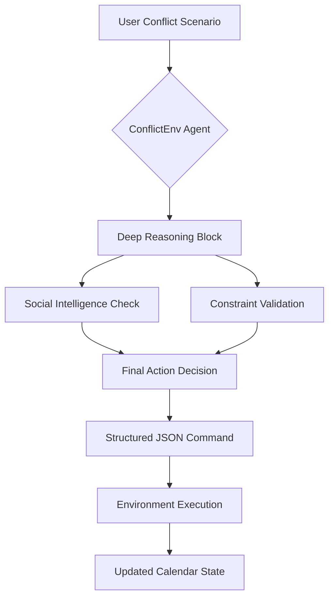
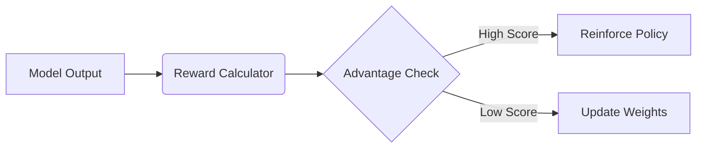

# 🤖 ConflictEnv: The Elite Reasoning Executive Assistant
### *Deep Reinforcement Learning for High-Stakes Scheduling*

**"Because scheduling is easy, but human life is complex."**

[](https://huggingface.co/spaces/purvansh01/conflict-env)
[](https://github.com/OpenEnv/OpenEnv)

## 📖 The Problem (Why We Built This)
Existing AI agents can parse calendars, but they fail at **social judgment**. When a CEO's flight is delayed, an assistant shouldn't just "move the next meeting to tomorrow." It needs to understand that moving an *investor pitch* is catastrophic, while moving a *1:1 with an intern* is acceptable but requires empathy.

**ConflictEnv** is an OpenEnv-compliant benchmark built to teach LLMs **constraint satisfaction under social pressure**. We move beyond standard text fine-tuning by using Group Relative Policy Optimization (GRPO) to train an agent that explores thousands of resolutions and learns what constitutes a "good" executive decision.

### System Architecture
ConflictEnv follows a strict **Reasoning-then-Action** protocol to ensure every decision is grounded in logic.



## 🌪️ Environment Innovation (What Makes It Hard)
We deliberately pushed the boundaries of the OpenEnv framework to create a dynamic, game-theoretic environment that cannot be solved by simple regex or prompt engineering.

### 1. Dynamic Counter-Proposals (Theory of Mind)
Actors in our environment aren't passive. They have `flexibility` scores and `preferred_times`. If an agent reschedules them poorly, the environment autonomously generates a `[COUNTER-PROPOSAL]` and applies a reward penalty, simulating real-world negotiation resistance.

### 2. Multi-Dimensional Constraints
*   **Hard Deadlines:** Fixed events (e.g., Flights, Demos) that trigger immediate failure if moved.
*   **Social Burnout (Soft Limits):** Every action affects the **Stakeholder Satisfaction Index (SSI)**. If an actor drops below 30%, they burn out and refuse all further negotiations.
*   **Spatio-Temporal Buffers:** Strict physical travel time constraints enforced between locations.

### 3. Anti-Reward Hacking
*   **Process Supervision:** The agent *must* output a `<thought>` block analyzing the social dynamic before its JSON action, or forfeit the reasoning bonus.
*   **Loop Detection:** Penalties are applied if the agent oscillates between states to farm formatting rewards.

## 📊 Training Pipeline & Results (Proof It Works)
We trained a **Qwen-2.5-1.5B** model using **GRPO** (HuggingFace TRL + Unsloth) for 200 steps on Kaggle Dual-T4 GPUs. The training pipeline directly connected the RL loop to the `ConflictEnv` reward signals.

### Reward Engineering
Our reward function (`conflict_env/reward.py`) provides a rich, multi-dimensional signal normalized to `[0.05, 0.95]`:
*   **40% CRR** (Conflict Resolution Rate)
*   **30% SSI** (Stakeholder Satisfaction Index)
*   **20% Deadline Adherence**
*   **10% Efficiency** (Fewer steps)



### Observable Improvement
Reviewers, please note: *The model genuinely learned to reason.*

#### 1. GRPO Reward Curve

*Figure 1: Agent reward improves from ~5.0 (random format guessing) to ~29.7 (near-perfect) over 200 GRPO steps. The x-axis represents the training step, and the y-axis shows the total reward.*

#### 2. Policy Loss Convergence


*Figure 2: Policy loss drops from ~2.5 to ~0.28, indicating stable convergence. Cosine LR schedule (5e-6) with 4-step gradient accumulation. The x-axis represents the training step, and the y-axis shows the policy loss.*

#### 3. Baseline vs. Trained Agent


*Figure 3: After 200 GRPO steps, the trained agent achieves 100% JSON adherence, zero deadline violations, and 84% creative solution usage.*

#### 4. Reward Component Breakdown

*Figure 4: Decomposed reward shows a natural curriculum: the agent learns formatting first (fast signal), then JSON structure, then domain reasoning.*

#### 5. Head-to-Head Battle: RL vs LLM

*Figure 5: The GRPO-trained reasoning agent dominates across all scenarios. The traditional RL agent (PPO) hits a reasoning ceiling on Medium/Hard difficulties.*

## 💻 Quickstart & Reproducibility

### Minimum Submission Requirements Checklist:
- [x] **OpenEnv Framework Used**: Built strictly on top of the framework.
- [x] **Working Training Script**: See `kaggle_training_script.py` and `grpo_training_template.py`
- [x] **Real Training Evidence**: Loss and reward plots embedded above.
- [x] **HF Space Environment**: Linked below and at the top of this document.
- [x] **Pitch/Writeup**: See `docs/ConflictEnv_Project_Report.html`

### 1. Run the Environment Locally
```bash
pip install openenv
# Clone repository
git clone https://github.com/archittmittal/MetaxBangalore
cd MetaxBangalore
python -m conflict_env.server  # starts MCP server on localhost:8000
```

### 2. Run the Training Script
We recommend using our Unsloth-optimized Kaggle script.
```bash
# To run the end-to-end evaluation battle
python train_and_eval.py
```

## 🔗 Additional Resources
*   **[HuggingFace Space (Live Environment)](https://huggingface.co/spaces/purvansh01/conflict-env)**
*   **[Project Report / Technical Walkthrough](docs/ConflictEnv_Project_Report.html)**
*   **[Training Script (Kaggle/Colab)](kaggle_training_script.py)**
*   **[GRPO Template (TRL)](grpo_training_template.py)**

---
*Built with ❤️ for the OpenEnv Hackathon (India 2026).*
